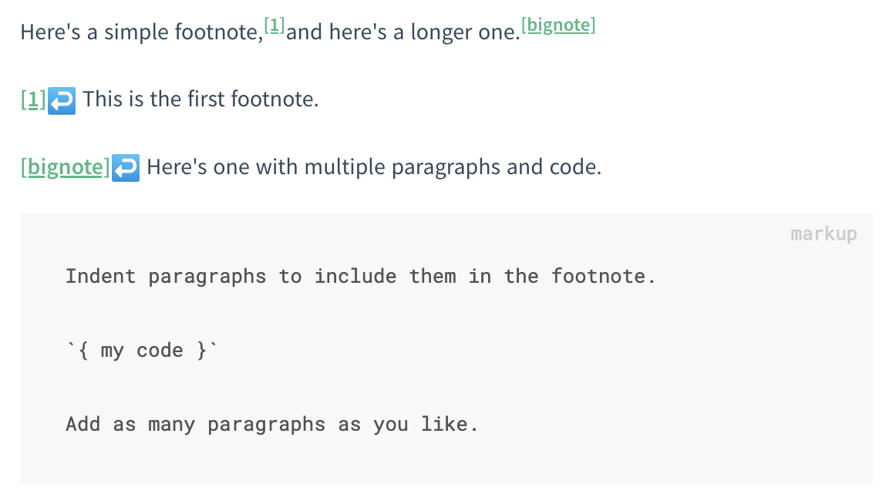

# docsify-footnotes

[](https://www.jsdelivr.com/package/npm/@sy-records/docsify-footnotes)
[](https://www.npmjs.com/package/@sy-records/docsify-footnotes)
[](https://github.com/sy-records/docsify-footnotes/blob/master/LICENSE)

A plugin that supports the use of footnotes in docsify.

一个支持在 docsify 中使用脚注的插件。

## Usage

```html
<script src="//cdn.jsdelivr.net/npm/@sy-records/docsify-footnotes/dist/index.min.js"></script>
```

## Example

```markup
Here's a simple footnote,[^1] and here's a longer one.[^bignote]


[^1]: This is the first footnote.

[^bignote]: Here's one with multiple paragraphs and code.

    Indent paragraphs to include them in the footnote.

    `{ my code }`

    Add as many paragraphs as you like.
```


