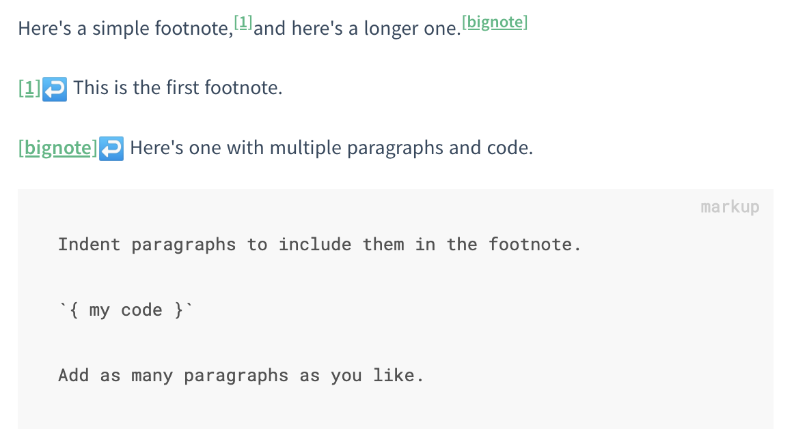

# docsify-footnotes

[](https://www.jsdelivr.com/package/npm/@sy-records/docsify-footnotes)
[](https://www.npmjs.com/package/@sy-records/docsify-footnotes)
[](https://github.com/sy-records/docsify-footnotes/blob/master/LICENSE)

A plugin that supports the use of footnotes in docsify.

一个支持在 docsify 中使用脚注的插件。

## Usage

```html
<script src="//cdn.jsdelivr.net/npm/@sy-records/docsify-footnotes@2/dist/index.min.js"></script>
```

## Configuration

You can configure the plugin by setting `footnotes` in your `$docsify` config object.

| Option | Type | Default                          | Description |
|---|---|----------------------------------|---|
| `backlinkIcon` | `string` | `':leftwards_arrow_with_hook:'` :leftwards_arrow_with_hook: | The icon rendered after each footnote definition as a backlink. Accepts an emoji, a Unicode character, an HTML entity string, or any arbitrary HTML. Set to `''` to disable the backlink icon entirely. |

### Examples

```js
window.$docsify = {
  footnotes: {
    // Default: emoji (may render large on some platforms)
    backlinkIcon: ':leftwards_arrow_with_hook:', // ↩

    // Unicode text glyph (avoids emoji scaling, recommended)
    backlinkIcon: '&#x21a9;&#xfe0e;',

    // Any HTML is accepted
    backlinkIcon: '<span class="footnote-backlink" aria-label="Back to reference" style="font-size:0.75em;line-height:1;">↩</span>',

    // Disable the backlink icon
    backlinkIcon: '',
  }
}
```

## Example Markdown

```markup
Here's a simple footnote,[^1] and here's a longer one.[^bignote]


[^1]: This is the first footnote.

[^bignote]: Here's one with multiple paragraphs and code.

    Indent paragraphs to include them in the footnote.

    `{ my code }`

    Add as many paragraphs as you like.
```


